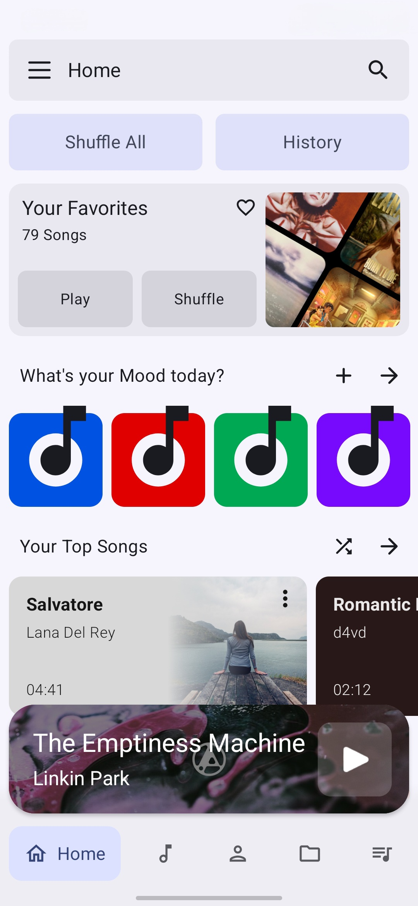
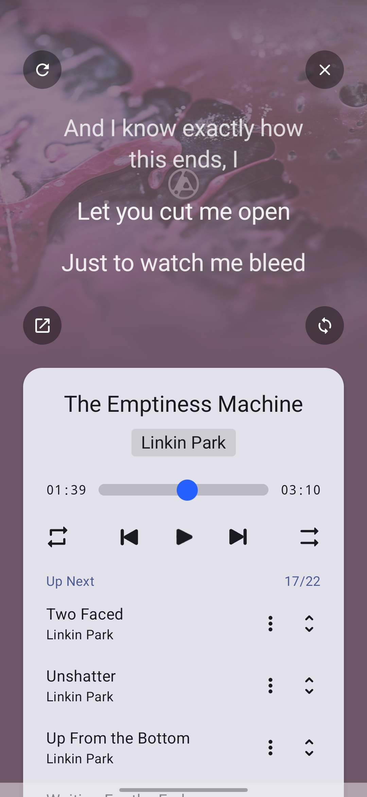
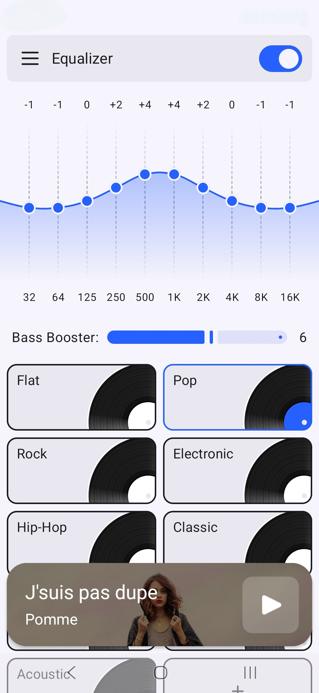
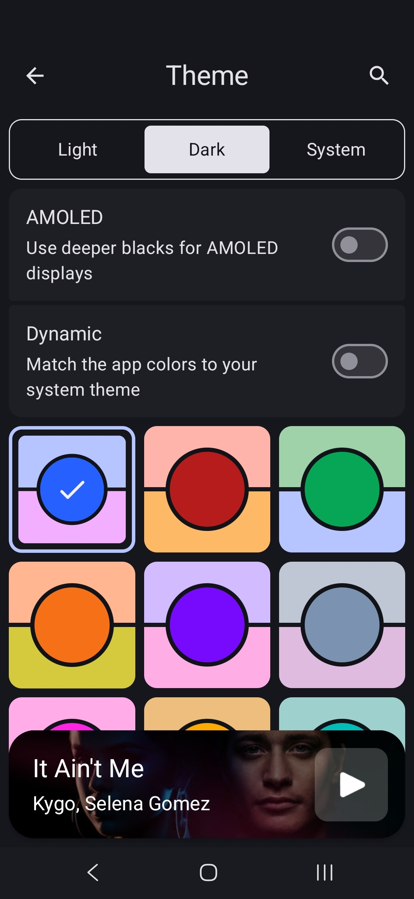

# Anathema Music Player

  

A modern, beautifully designed offline music player for Android with powerful customization, advanced audio features, and an exceptional user experience.

  
  

---

## ✨ About

Anathema is a modern offline music player built for people who care about both beautiful design and powerful functionality.

Instead of overwhelming users with complicated menus, Anathema focuses on an intuitive experience while providing advanced features that make managing and enjoying your music effortless.

Everything is designed with attention to detail—from smooth animations and elegant layouts to professional audio controls and extensive personalization options.

---

## 📱 Features

### 🎨 Beautiful & Highly Customizable UI

- Modern Material Design interface
- Fully optimized Dark Mode
- Dynamic accent colors
- Custom fonts
- Multiple player styles
- Personalize almost every visual element

---

### 🎵 Smart Music Organization

Organize your music beyond traditional playlists.

Anathema introduces **Moods**, allowing you to assign one or multiple color-coded labels to every song for quick filtering and discovery.

---

### 🎤 Auto-Synced Lyrics

- One-click lyric search
- Line-by-line synchronized lyrics
- Fast lyric loading

*Multi-language lyric translation is currently in development.*

---

### ✏️ Metadata Editor

Edit your music library directly inside the app. Automatic metadata recognition and online matching are planned for future releases.

---

### 🎚 Professional Equalizer

- 10-band Equalizer
- Bass Boost
- Genre presets
- Create unlimited custom presets

---

### ⏱ Playback Controls

- Playback speed adjustment
- Sleep timer
- Smooth queue management

---

### 📊 Smart Statistics

Anathema keeps track of your listening habits and automatically generates:

- Top Songs
- Top Artists
- Listening History
- Personalized recommendations from your local library

---

### 🌍 Languages

Currently supported:

- English
- فارسی (Persian)

More languages are coming soon.

---

## 🖼 Screenshots

| Home | Player | Lyrics |
|------|--------|---------|
|  |  |  |

| Equalizer | Moods | Settings |
|-----------|--------|----------|
|  |  |  |

---

## 🛣 Roadmap

Upcoming features include:

- AI-powered metadata recognition
- Multi-language lyric translation
- More themes and player layouts
- Additional Mood customization
- Cloud backup & restore
- More personalization options

---

## 💬 Feedback

Found a bug or have a feature request?

Please open an Issue on GitHub.

Your feedback helps improve Anathema.

---

## ❤️ Support

If you enjoy using Anathema, consider:

- ⭐ Starring this repository
- Sharing the app with friends
- Leaving a review on the store

Every bit of support helps the project grow.

---

## 📄 License

This repository contains the public homepage and issue tracker for Anathema Music Player.

All rights reserved.

The application itself is proprietary software.
